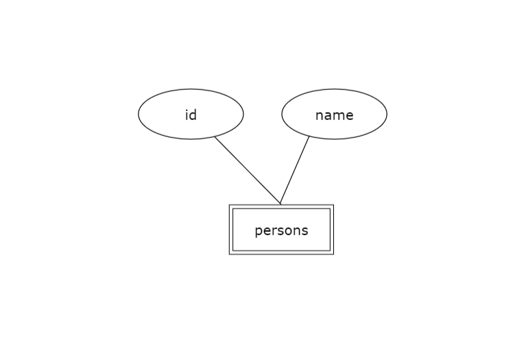
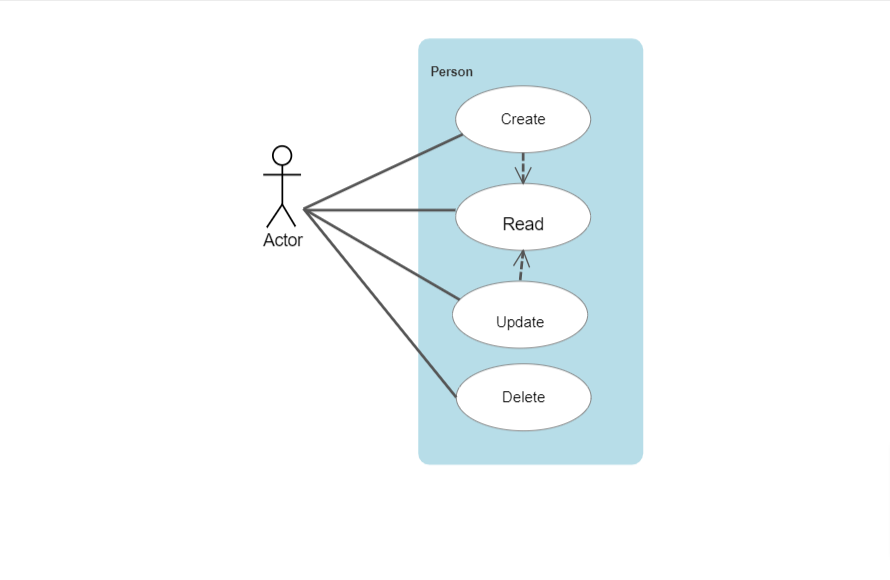

# Hng Stage 2 Task Solution repository (Nestjs app).

## Installation

```bash
$ git clone https://github.com/gaiyadev/Hng-stage-2-task.git
$ cd Hng-stage-2-task
```

```bash
$ npm install
```

## Running the app

```bash
# development
$ npm run start

# watch mode
$ npm run start:dev

# production mode
$ npm run start:prod
```

## Test

```bash
# e2e tests
$ npm run test:e2e

# test coverage
$ npm run test:cov
```

# API Documentation

## Add a New Person

**Request:**

- **Method:** POST
- **Endpoint:** `https://gaiyaobed-hng-stage-2-task.onrender.com/api/`
- **Payload:**

```json
{
  "name": "musk"
}
```
Response:

Status Code: 201 Created

```json
{
  "message": "Added successfully",
  "statusCode": 201,
  "status": "Success",
  "data": {
    "id": 14,
    "name": "musk"
  }
}

```

## Search Persons

**Request:**

- **Method:** GET
- **Endpoint:** `https://gaiyaobed-hng-stage-2-task.onrender.com/api/`
- Endpoint: `localhost:3000/api?search=musk`

Response:

Status Code: 200 OK
```json
{
  "message": "Fetched successfully",
  "statusCode": 200,
  "status": "Success",
  "data": [
    {
      "id": 7,
      "name": "musk"
    },
    {
      "id": 8,
      "name": "musk"
    },
    {
      "id": 9,
      "name": "musk"
    },
    {
      "id": 10,
      "name": "musk"
    },
    {
      "id": 11,
      "name": "musk"
    }
  ]
}

```
## Search a Person

**Request:**

- **Method:** GET
- **Endpoint:** `https://gaiyaobed-hng-stage-2-task.onrender.com/api/user_id`

Response:
Status Code: 200 OK

```json
{
  "message": "Fetched successfully",
  "statusCode": 200,
  "status": "Success",
  "data": {
    "id": 12,
    "name": "musk"
  }
}
```

## Update a Person

**Request:**

- **Method:** PATCH
- **Endpoint:** `https://gaiyaobed-hng-stage-2-task.onrender.com/api/user_id`
- **Payload:**

```json
{
  "name": "musk"
}
```
Response:

Status Code: 201 Created
Body:

```json
{
  "message": "Updated successfully",
  "statusCode": 201,
  "status": "Success",
  "data": {
    "id": 1,
    "name": "musk"
  }
}
```

## Delete a Person

**Request:**

- **Method:** DELETE
- **Endpoint:** `https://gaiyaobed-hng-stage-2-task.onrender.com/api/user_id`

Response:

Status Code: 200 OK

```json
{
  "message": "Deleted successfully",
  "statusCode": 200,
  "status": "Success",
  "data": {
    "raw": [],
    "affected": 1
  }
}
```

## E-R Digram

In this E-R diagram representation:

- `persons` is the table name.
- `- id: number (PK)` indicates that `id` is the primary key of the table.
- `- name: text` represents the `name` column with a data type of text.

This diagram visually illustrates the structure of the `persons` table in the database, including its primary key and the `name` column.


## UML Digram

In this UML  diagram representation:

- `Actor` is the person making api call.
- `-Create` indicates adding new person.
- `-Read` indicates getting all persons.
- `-Update` indicates modification of person detail.
- `-Delete` indicates removing a persons.

This diagram visually illustrates the UML of the `actor` making api calls to `Create` `Read`
`Delete` and `Update` endpoints.

## Support

## Stay in touch

## License

